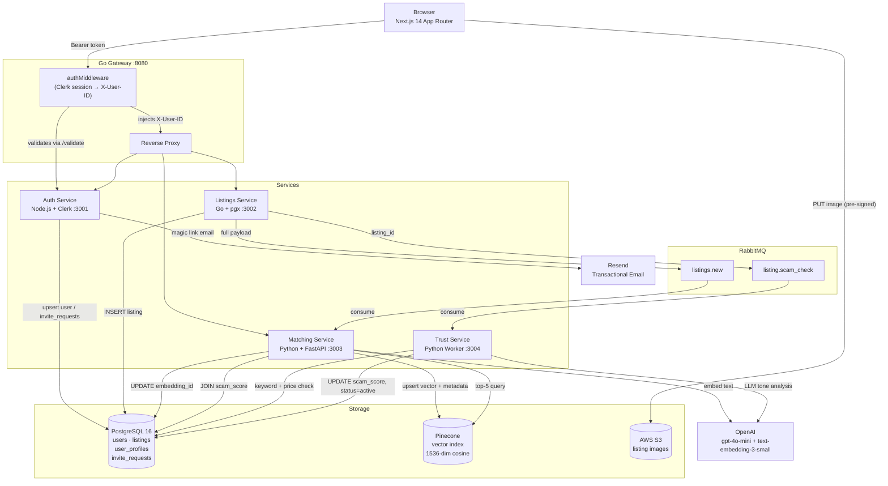

# Subly — Student Subleasing Marketplace

A trust-first sublease platform built exclusively for verified students. Every listing is invite-gated and `.edu`-verified, AI-embedded for semantic search, and scored for fraud before it reaches a renter.

---

## System Architecture



### Request flow — posting a listing

```
Browser → Gateway (auth check) → Listings Service → Postgres (draft)
                                                   ↓
                                      listings.new ──→ Matching (embed → Pinecone)
                               listing.scam_check ──→ Trust (score → Postgres, status=active)
```

### Invite flow — joining the platform

```
Visitor fills invite form → Auth Service stores invite_request (pending)
Admin approves via /admin/invites → Auth Service generates HMAC token
                                  → Resend sends magic link email
Visitor clicks magic link → /signup?token=X → verifies token
                          → Creates Clerk account → .edu verification → Onboarding
```

---

## Tech Stack

| Layer | Technology | Why |
|---|---|---|
| **Frontend** | Next.js 14 App Router | Server Components eliminate client/server waterfalls for auth-gated pages. Server Actions replace API routes for form submissions, keeping auth logic server-side and credentials out of the browser. |
| **API Gateway** | Go | Go's goroutine-per-request model handles high concurrency with minimal memory overhead — ideal for a reverse proxy that validates a Clerk session on every inbound request before forwarding. |
| **Auth Service** | Node.js + Clerk | Clerk handles OAuth, MFA, and session management. `.edu` domain verification is the platform's core trust primitive. Invite-gated signup flow with HMAC-signed magic links prevents unauthorized access. |
| **Listings Service** | Go + pgx | Type-safe Postgres driver with connection pooling. Publishes to two RabbitMQ queues on every write. Partial-update `PATCH` with dynamic `SET` clause and ownership enforcement via `X-User-ID`. |
| **Matching Service** | Python + FastAPI | Python is the lingua franca for ML tooling. FastAPI's async support lets the service run a RabbitMQ consumer and serve HTTP traffic in the same process without threads. |
| **Trust Service** | Python | Isolated worker — no HTTP surface beyond `/healthz`. Three-signal scoring (keyword heuristics 30%, price anomaly 20%, LLM tone 50%) runs fully async after listing creation. |
| **Vector DB** | Pinecone | Managed ANN index with metadata filtering. Hard constraints (university, rent ceiling, bedrooms) are applied *before* re-ranking by cosine similarity — avoiding the false-positive problem of pure vector search. |
| **Message Broker** | RabbitMQ | Durable queues decouple listing creation from the two expensive downstream operations (embedding + fraud scoring). If either service is slow or restarting, no listings are lost. |
| **Database** | PostgreSQL 16 | ACID guarantees for financial data (rent stored in cents). `uuid-ossp` and `pg_trgm` extensions. `updated_at` triggers on all mutable tables. |
| **Image Storage** | AWS S3 + Pre-signed URLs | The gateway and application servers never handle image bytes — the browser uploads directly to S3. Eliminates a bottleneck and keeps all compute services stateless. |
| **Transactional Email** | Resend | Fire-and-forget invite email after admin approval. Falls back to console logging when `RESEND_API_KEY` is unset so local development works without email credentials. |
| **Validation** | Zod | Single schema definition shared between the Server Action (server-side parse) and the form component (client-side parse). One source of truth, two enforcement points. |

---

## Key Engineering Challenges

### 1. Listings Stuck in Draft — Trust Service Gap

**The bug.** After the trust service scored a listing for fraud, it updated `scam_score` in Postgres but never changed `status` from `'draft'` to `'active'`. The listings service's `GET /listings` only returns `status = 'active'` rows, so the browse page and dashboard were always empty — even after listings were created and scored.

**The diagnosis.** The trust service was designed as a pure scoring worker: it consumed the queue, ran the three-signal pipeline, and wrote the score. Transitioning the listing's lifecycle state was never explicitly assigned to it. The result was a silent correctness gap — no error was thrown, the score was written, but the listing was permanently stuck in `draft`.

**The fix.** One-line change in `services/trust/main.py`:
```python
# Before
cur.execute("UPDATE listings SET scam_score = %s WHERE id = %s", (final, listing_id))

# After
cur.execute("UPDATE listings SET scam_score = %s, status = 'active' WHERE id = %s", (final, listing_id))
```

**Why the trust service owns the transition.** The listing goes `draft → active` only after it has been scored. The trust service is the only component that knows when scoring is complete. Putting the transition anywhere else (e.g., the listings service on `POST`) would allow unscored listings to appear in search results.

---

### 2. RabbitMQ Queue Ownership Fix

**The bug.** During scaffolding, the Matching service and the Trust service both declared consumers on `listing.scam_check`. RabbitMQ distributes messages round-robin across all consumers on the same queue. The result: each message was delivered to exactly *one* consumer — either embedding happened *or* scoring happened, never both.

**The fix.** Explicit queue ownership across two queues:

| Queue | Owner | Payload |
|---|---|---|
| `listings.new` | Matching service (sole consumer) | Full listing JSON — no DB round-trip needed for embedding |
| `listing.scam_check` | Trust service (sole consumer) | `{"listing_id": "..."}` |

The Listings service publishes to *both* on every `POST /listings`. Single-consumer queues are now an architectural invariant.

**Why this matters.** Accidental multi-consumer queues are a silent correctness bug: no error is thrown, messages are processed, but each message is only half-handled. The fix required understanding AMQP semantics, not just debugging application code.

---

### 3. S3 Pre-signed URL Implementation

**The problem.** The naive upload path — browser → Next.js server → S3 — ties up the server process during transfer, doubles bandwidth costs, and makes compute services stateful.

**The solution.**
```
1. Browser calls getPresignedUrl() Server Action
2. Server generates a PutObject signed URL (5-min TTL, scoped to one S3 key)
3. Browser PUTs the file directly to S3 — server is not in the path
4. Browser records the public S3 URL in component state
5. On form submit, the URL array is sent to Listings Service as plain strings
```

`AWS_ACCESS_KEY_ID` and `AWS_SECRET_ACCESS_KEY` stay server-side. Each key is namespaced `listings/{uuid}/{sanitized-filename}`. Uploads fire `onChange` so images are already in S3 before the user submits the form; the submit button is disabled while any upload is in flight.

---

### 4. Invite-Gated Signup with HMAC Magic Links

**The requirement.** The platform is closed — users can only sign up if an admin has explicitly approved their invite request. A non-.edu email (or anyone without an approved invite) cannot create an account.

**The flow.**
1. Visitor submits `POST /invite-request` with their email and university name. Status is `pending`.
2. Admin reviews pending requests at `/admin/invites` and approves or rejects.
3. On approval, the auth service generates a single-use HMAC-SHA256 token (30-min TTL) and fires a Resend email with the magic link.
4. Visitor clicks the link → `GET /invite-request/verify?token=X` validates the token and returns a signed payload.
5. The signup page (`/signup?token=X`) reads the pre-filled email, the user creates a Clerk account, and the token is redeemed (marked `redeemed`).

The token is signed with `INVITE_SECRET` and includes expiry. Replay attacks are prevented by the single-use `redeemed_at` column. If `RESEND_API_KEY` is not set, the magic link is logged to stdout so local development works without email credentials.

---

## Pages & Routes

| Route | Auth | Purpose |
|---|---|---|
| `/` | Public | Landing page — invite request form, scroll-aware nav |
| `/signup` | Public | Magic link signup (invite token required) |
| `/signup/complete` | Public | Post-signup redirect handler |
| `/onboarding` | Clerk | `.edu` email verification + Vibe Check preferences |
| `/dashboard` | Clerk + edu | Personalized match feed (semantic + preference-filtered) |
| `/listings` | Clerk + edu | Browse all active listings with filters |
| `/listings/new` | Clerk + edu | Create a new sublease listing |
| `/listings/my` | Clerk + edu | Manage your own listings (pause / reactivate / mark leased) |
| `/listings/[id]` | Clerk + edu | Full listing detail — images, stats, trust badge |
| `/listings/[id]/edit` | Clerk + owner | Edit a listing (ownership enforced server-side) |
| `/admin/invites` | Admin only | Review and approve/reject invite requests |
| `/privacy`, `/terms`, `/cookies` | Public | Legal pages |

---

## Quick Start

### Prerequisites

- [Docker Desktop](https://www.docker.com/products/docker-desktop/) (running)
- Four external API keys (see below)

### 1. Clone and configure

```bash
git clone https://github.com/AarushPathak1/Subly.git
cd Subly
cp .env.example .env
```

Open `.env` and fill in:

| Variable | Where to get it |
|---|---|
| `CLERK_SECRET_KEY`, `CLERK_PUBLISHABLE_KEY` | [dashboard.clerk.com](https://dashboard.clerk.com) → Create application → API Keys |
| `OPENAI_API_KEY` | [platform.openai.com/api-keys](https://platform.openai.com/api-keys) |
| `PINECONE_API_KEY` | [app.pinecone.io](https://app.pinecone.io) → create index `subly-listings`, dimension `1536`, metric `cosine` |
| `AWS_*`, `S3_BUCKET_NAME` | AWS Console → S3 bucket + IAM user with `s3:PutObject`. Optional — omit to test without image uploads. |
| `RESEND_API_KEY` | [resend.com](https://resend.com) → API Keys. Optional — magic links log to stdout when unset. |

### 2. Start all services

```bash
docker compose up --build
```

First build takes ~3 minutes. All eight containers start together.

| Service | URL |
|---|---|
| Web app | http://localhost:3000 |
| Gateway | http://localhost:8080/healthz |
| RabbitMQ management | http://localhost:15672 (user: `subly`, pass: `subly_secret`) |
| Postgres | `localhost:5434` (user: `subly`, pass: `subly_secret`, db: `subly`) |

### 3. Test the full loop

1. Go to `localhost:3000` → submit an invite request with any non-`.edu` email
2. Open `localhost:3000/admin/invites` (set `ADMIN_USER_IDS` in `.env` to your Clerk user ID)
3. Approve the invite — a magic link is generated (and emailed if Resend is configured)
4. Click the magic link → create your Clerk account → verify `.edu` email on the onboarding page
5. Complete the Vibe Check (sets `user_profiles` preferences)
6. Post a sublease at `/listings/new`
7. Watch the RabbitMQ dashboard — messages flow through `listings.new` (embedding) and `listing.scam_check` (fraud scoring) in real-time
8. Dashboard populates with match cards ranked by semantic similarity; **High Risk** badge appears on listings scoring above 0.7

### Useful commands

```bash
# Stream all service logs
docker compose logs -f

# Stream a single service
docker compose logs -f trust

# Rebuild and restart one service after a code change
docker compose up --build web -d

# Full reset — removes all data
docker compose down -v
```

---

## Project Structure

```
subly/
├── gateway/                   # Go reverse proxy + Clerk session middleware
├── services/
│   ├── auth/                  # Node.js + Clerk — invite flow, .edu verification, user profiles
│   │   ├── src/index.js       # Express server (invite CRUD, magic links, Resend)
│   │   ├── src/helpers.js     # HMAC token signing + university lookup
│   │   └── __mocks__/         # Jest manual mocks (pg, amqplib, @clerk/express, resend)
│   ├── listings/              # Go + pgx — CRUD, dual RabbitMQ publisher
│   ├── matching/              # Python + FastAPI — Pinecone embedding + semantic search
│   └── trust/                 # Python worker — heuristic + LLM fraud scoring + status promotion
├── web/                       # Next.js 14 App Router
│   └── src/
│       ├── app/               # All routes (landing, onboarding, dashboard, listings/*, admin/*)
│       │   └── LandingNav.tsx # Scroll-aware nav (white over hero, slate below)
│       ├── components/        # AppNav, UniversityCombobox, GetStartedFlow, SublyLogo
│       └── lib/               # actions.ts (Server Actions), schemas.ts (Zod), auth.ts
├── infra/
│   ├── postgres/init.sql      # Schema: users, listings, user_profiles, invite_requests, conversations
│   └── rabbitmq/
├── docker-compose.yml
└── .env.example
```

---

## Environment Variables

```bash
# Infrastructure (defaults work out of the box)
POSTGRES_USER=subly
POSTGRES_PASSWORD=subly_secret
POSTGRES_DB=subly
RABBITMQ_USER=subly
RABBITMQ_PASS=subly_secret

# Clerk (required)
CLERK_SECRET_KEY=sk_test_...
CLERK_PUBLISHABLE_KEY=pk_test_...

# OpenAI (embeddings + fraud LLM — required)
OPENAI_API_KEY=sk-...

# Pinecone (required)
PINECONE_API_KEY=...
PINECONE_INDEX=subly-listings

# AWS S3 — listing image uploads via pre-signed URLs (optional)
AWS_REGION=us-east-1
AWS_ACCESS_KEY_ID=...
AWS_SECRET_ACCESS_KEY=...
S3_BUCKET_NAME=subly-listing-images

# Resend — transactional email for magic links (optional; logs to stdout if unset)
RESEND_API_KEY=re_...
FROM_EMAIL=Subly <invites@subly.app>

# Admin
ADMIN_SECRET=dev-admin-secret-change-in-prod
ADMIN_USER_IDS=user_clerk_id_1,user_clerk_id_2
INVITE_SECRET=dev-invite-secret-change-in-prod

# URLs
APP_URL=http://localhost:3000
```
