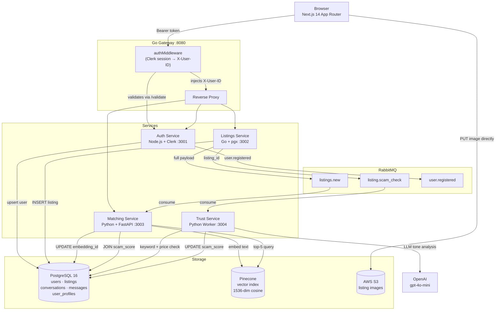

# Subly — Student Subleasing Marketplace

A trust-first sublease platform built exclusively for verified students. Every listing is `.edu`-gated, AI-embedded for semantic search, and scored for fraud before it reaches a renter.

---

## System Architecture



### Request flow — posting a listing

```
Browser → Gateway (auth check) → Listings Service → Postgres
                                                   ↓
                                            listings.new ──→ Matching (embed → Pinecone)
                                            listing.scam_check ──→ Trust (score → Postgres)
```

---

## Tech Stack

| Layer | Technology | Why |
|---|---|---|
| **Frontend** | Next.js 14 App Router | Server Components eliminate client/server waterfalls for auth-gated pages. Server Actions replace API routes for form submissions, keeping auth logic server-side and credentials out of the browser. |
| **API Gateway** | Go | Go's goroutine-per-request model handles high concurrency with minimal memory overhead — ideal for a reverse proxy that validates a Clerk session on every inbound request before forwarding. |
| **Auth Service** | Node.js + Clerk | Clerk handles OAuth, MFA, and session management out of the box. Node.js is a natural fit for the Clerk SDK and keeps the service lightweight. `.edu` domain verification is the platform's core trust primitive. |
| **Listings Service** | Go + pgx | Type-safe Postgres driver with connection pooling. Go's standard library HTTP server is production-grade with no framework overhead. Publishes to two RabbitMQ queues on every write. |
| **Matching Service** | Python + FastAPI | Python is the lingua franca for ML tooling. FastAPI's async support lets the service run a RabbitMQ consumer and serve HTTP traffic in the same process without threads. |
| **Trust Service** | Python | Isolated worker — no HTTP surface needed beyond `/healthz`. Python's ecosystem made it trivial to integrate OpenAI's SDK and tune the heuristic scoring logic independently of the matching pipeline. |
| **Vector DB** | Pinecone | Managed ANN index with metadata filtering. Hard constraints (university, rent ceiling, bedrooms) are applied *before* re-ranking by cosine similarity — avoiding the false-positive problem of pure vector search. |
| **Message Broker** | RabbitMQ | Durable queues decouple listing creation from the two expensive downstream operations (embedding + fraud scoring). If either service is slow or restarting, no listings are lost. |
| **Database** | PostgreSQL 16 | ACID guarantees for financial data (rent stored in cents). `uuid-ossp` and `pg_trgm` extensions for UUID primary keys and fuzzy text search. `updated_at` triggers on all mutable tables. |
| **Image Storage** | AWS S3 + Pre-signed URLs | The gateway and application servers never handle image bytes — the browser uploads directly to S3. Eliminates a bottleneck and keeps all compute services stateless. |
| **Validation** | Zod | Single schema definition shared between the Server Action (server-side parse) and the form component (client-side parse). One source of truth, two enforcement points, zero duplicated rules. |
| **Notifications** | Sonner | Lightweight toast library compatible with Server Actions' redirect model — fires before `router.push()` so the user sees confirmation before navigation. |

---

## Key Engineering Challenges

### 1. RabbitMQ Queue Ownership Fix

**The bug.** During development, the Matching service and the Trust service both declared consumers on `listing.scam_check`. RabbitMQ distributes messages round-robin across all consumers on the same queue. The result: each listing message was delivered to exactly *one* consumer — either the Matching service (which would embed it) *or* the Trust service (which would score it), never both. Listings appeared in search results unscored, and scored listings sometimes had no Pinecone vector.

**The diagnosis.** The root cause was a scaffold decision made early: the Matching service used `listing.scam_check` as its embedding trigger before the Trust service existed. When the Trust service was added as the *intended* consumer of that queue, the consumer registration in Matching was never removed.

**The fix.** We split the concerns cleanly across two queues with explicit ownership:

| Queue | Owner | Payload |
|---|---|---|
| `listings.new` | Matching service (sole consumer) | Full listing JSON — no DB round-trip needed for embedding |
| `listing.scam_check` | Trust service (sole consumer) | `{"listing_id": "..."}` |

The Listings service publishes to *both* on every `POST /listings`. The Matching service's `consume_scam_queue()` was removed entirely. Single-consumer queues are now an architectural invariant.

**Why this matters.** In a microservices system, a queue with multiple consumers is a fan-out *by design* — you use a fanout exchange or competing consumers intentionally. Accidental multi-consumer queues are a silent correctness bug: no error is thrown, messages are processed, but each message is only half-handled. The fix required understanding AMQP semantics, not just debugging application code.

---

### 2. S3 Pre-signed URL Implementation

**The problem.** The naive upload path — browser → Next.js server → S3 — creates a three-hop route that: (a) ties up the server process during the transfer, (b) doubles bandwidth costs, and (c) introduces a single point of failure for what should be a client-to-storage operation.

**The solution.** Pre-signed URLs shift the upload entirely off the application server:

```
1. Browser calls getPresignedUrl() Server Action
2. Server Action generates a PutObject signed URL (5-min TTL, scoped to one key)
3. Browser PUTs the file directly to S3 — server is not in the path
4. Browser records the public S3 URL in component state
5. On form submit, the URL array is sent to the Listings Service as plain strings
```

The Server Action runs server-side, so `AWS_ACCESS_KEY_ID` and `AWS_SECRET_ACCESS_KEY` never reach the browser. Each key is namespaced `listings/{uuid}/{sanitized-filename}` — the UUID prevents collisions, the sanitization strips characters that break S3 key parsing.

**The UX detail.** Uploads are triggered `onChange` (not on form submit) so images are already in S3 by the time the user clicks "Post Sublease". The submit button is disabled while any upload is in flight. If an upload fails, `toast.error()` fires immediately and the file input resets so the user can retry without refreshing.

---

## Quick Start

### Prerequisites

- [Docker Desktop](https://www.docker.com/products/docker-desktop/) (running)
- Four external API keys (see below)

### 1. Clone and configure

```bash
git clone https://github.com/AarushPathak1/Subly.git
cd Subly
cp .env.example .env
```

Open `.env` and fill in:

| Variable | Where to get it |
|---|---|
| `CLERK_SECRET_KEY`, `CLERK_PUBLISHABLE_KEY` | [dashboard.clerk.com](https://dashboard.clerk.com) → Create application → API Keys |
| `OPENAI_API_KEY` | [platform.openai.com/api-keys](https://platform.openai.com/api-keys) |
| `PINECONE_API_KEY` | [app.pinecone.io](https://app.pinecone.io) → create index named `subly-listings`, dimension `1536`, metric `cosine` |
| `AWS_*`, `S3_BUCKET_NAME` | AWS Console → S3 (create bucket) + IAM user with `s3:PutObject`. Optional — skip to test without image uploads. |

### 2. Start all services

```bash
docker compose up --build
```

First build takes ~3 minutes. All eight containers start together — no separate frontend or backend commands.

| Service | URL |
|---|---|
| Web app | http://localhost:3000 |
| Gateway | http://localhost:8080/healthz |
| RabbitMQ management | http://localhost:15672 (user: `subly`, pass: `subly_secret`) |

### 3. Test the full loop

1. `localhost:3000` → sign in via Clerk
2. Verify your `.edu` email on the verification page
3. Complete the Vibe Check (sets `user_profiles` preferences)
4. Post a sublease at `/listings/new`
5. Watch the RabbitMQ dashboard — messages flow through `listings.new` (embedding) and `listing.scam_check` (fraud scoring) in real time
6. Dashboard populates with match cards ranked by semantic similarity; **High Risk** badge appears on any listing that scores above 0.7

### Useful commands

```bash
# Stream all service logs
docker compose logs -f

# Stream a single service
docker compose logs -f trust

# Rebuild and restart one service after a code change
docker compose up --build listings -d

# Full reset — removes all data
docker compose down -v
```

---

## Project Structure

```
subly/
├── gateway/                   # Go reverse proxy + auth middleware
├── services/
│   ├── auth/                  # Node.js + Clerk — .edu verification, user profiles
│   ├── listings/              # Go + pgx — CRUD, dual RabbitMQ publisher
│   ├── matching/              # Python + FastAPI — Pinecone embedding + search
│   └── trust/                 # Python worker — heuristic + LLM fraud scoring
├── web/                       # Next.js 14 — App Router, Server Actions, Clerk
│   └── src/
│       ├── app/               # Routes: verify, onboarding, dashboard, listings/new
│       └── lib/               # actions.ts (Server Actions), auth.ts, schemas.ts (Zod)
├── infra/
│   ├── postgres/init.sql      # Schema: users, listings, conversations, user_profiles
│   └── rabbitmq/
├── docker-compose.yml
└── .env.example
```

---

## Environment Variables

```bash
# Infrastructure (defaults work out of the box)
POSTGRES_USER=subly
POSTGRES_PASSWORD=subly_secret
POSTGRES_DB=subly
RABBITMQ_USER=subly
RABBITMQ_PASS=subly_secret

# Clerk
CLERK_SECRET_KEY=sk_test_...
CLERK_PUBLISHABLE_KEY=pk_test_...

# OpenAI (embeddings + fraud LLM)
OPENAI_API_KEY=sk-...

# Pinecone
PINECONE_API_KEY=...
PINECONE_INDEX=subly-listings

# AWS S3 (listing image uploads via pre-signed URLs)
AWS_REGION=us-east-1
AWS_ACCESS_KEY_ID=...
AWS_SECRET_ACCESS_KEY=...
S3_BUCKET_NAME=subly-listing-images
```
